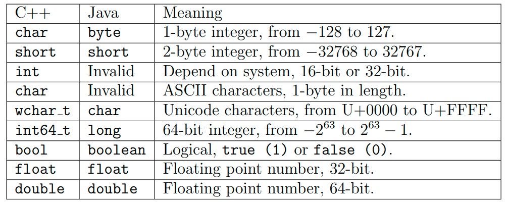

# CÁC KIỂU DỮ LIỆU TRONG JAVA

## 1. Các kiểu dữ liệu nguyên thủy
- Kiểu Boolean
```java
    Boolean isDone = false
```

- Kiểu byte: Lưu trữ số nguyên kích cỡ = 1 byte (8 bit), từ -128 -> 127
```java
    byte a = 100
```

- Kiểu Short: Lưu trữ số nguyên kích cỡ = 2 byte (16 bit), từ -32768 -> 32767
```java
    short a = 10000
```

- Kiểu int: Lưu trữ số nguyên kích cỡ = 4 byte (32 bit), từ -2^31 -> 2^31-1
```java
    int a = 2000000
```

- Kiểu long: Lưu trữ số nguyên kích cỡ = 8 bye (64 bit), từ -2^63 -> 2^63 - 1. Có chữ 'l' phía sau
```java
    long a = 1001000l
```

- Kiểu loat: Lưu trữ số thực kích cỡ = 4 byte (32 bit), từ -3.4028235* 10^38 -> 3.4028235*10^38. Có chữ 'f' phía sau
```java
    float a = 2.51f
```

- Kiểu double: u trữ số thực kích cỡ = 8 byte (64 bit), từ -1.7976931348623157 * 10^308 -> 1.7976931348623157 10^308. Có hoặc không có chữ 'd' phía sau
```java
    double a  = 2.52d hoặc double a = 2.52
```

- Kiểu char: như C++


## 3. So sánh vs C++
### 3.1 Kiểu số học


### 3.2 Chuỗi

```C++
char a[] = "abc"; // C++
```

```java
String a = "abc"; // java
```

### 3.3 Mảng động
- Cấp phát và thu hồi bộ nhớ trong C++
```C++
int m = 3, n = 4, k = 5;

int ***arr = new int **[m];
for (int i = 0; i < m; i++)
{
    arr[i] = new int *[n];
    for (int j = 0; j < n; j++)
        arr[i][j] = new int[k];
}

// Deallocate the dynamic array
for (int i = 0; i < 3; i++)
{
    for (int j = 0; j < 4; j++)
        delete[] arr[i][j];
    delete[] arr[i];
}
delete[] arr;
```
- Mảng động trong Java
```java
int m = 3, n = 4, k = 5;
int[][][] arr = new int[m][n][k];
```

